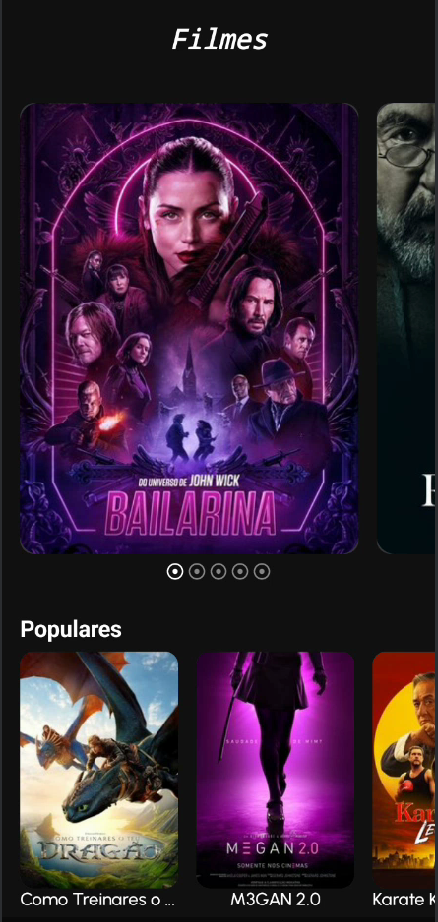
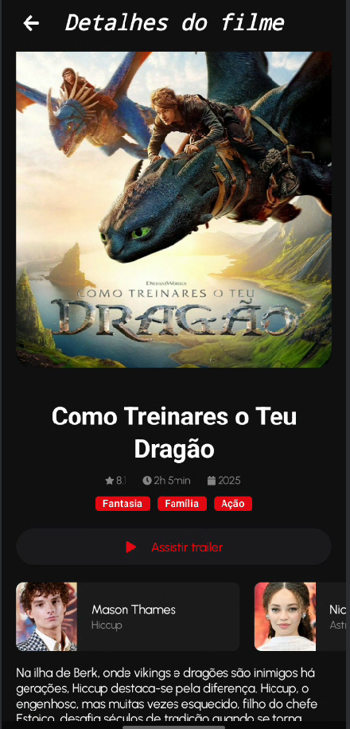

# 🎬 Movies – Kotlin Multiplatform App (Compose Multiplatform)

A modern multiplatform movie discovery app, built using the [The Movie Database (TMDb)](https://www.themoviedb.org/) API. Developed with **Kotlin Multiplatform** and **Compose Multiplatform (CMP)**, this project showcases best practices in architecture, shared business logic, and declarative UI.

---




## ⚙️ Clean Architecture

The project follows **Clean Architecture** principles, enabling low coupling, high cohesion, and testability:

```
├── data/ → Repositories, data sources (remote and local)
├── domain/ → Use Cases and business entities
├── ui/ → UI layer (Compose), ViewModels and UI states
├── di/ → Dependency injection modules
└── utils/ → Helpers, configuration, and reusable extensions
```


---

## 🧰 Technologies and Tools

### 🛠️ Core Technologies

- **Kotlin Multiplatform (2.2.0)** – Shared codebase between Android and iOS
- **Compose Multiplatform (1.8.2)** – Unified declarative UI
- **Gradle Version Catalogs** – Centralized dependency management via `libs.versions.toml`

### 📱 Supported Targets

- **Android**: `minSdk = 24`, `targetSdk = 35`
- **iOS**: Kotlin/Native with SwiftUI integration

---

## 🔌 Libraries Used

### 📡 Networking

- `ktor-client-core`
- `ktor-client-okhttp`
- `ktor-client-darwin`
- `ktor-content-negotiation`
- `ktor-serialization-json`

### 🧪 Dependency Injection

- `koin-core`
- `koin-compose`
- `koin-compose-viewmodel`

### 🧠 State Management & Lifecycle

- `androidx.lifecycle-viewmodel`
- `lifecycle-viewmodel-compose`

### 🔀 Navigation

- `androidx.navigation-compose`

### 🖼️ Image Loading

- `coil-compose`
- `coil-network-ktor3`

### 🧾 Serialization

- `kotlinx-serialization-json`

### ⚙️ Utilities

- `kotlinx-coroutines-core`
- `kotlinx-datetime`
- `collections-immutable`
- `lyricist` (i18n for Compose)

---

## 🧱 Patterns & Best Practices

- **Clean Architecture**: clear separation of concerns
- **MVVM + MVI**: unidirectional data flow and immutable UI states
- **Repository Pattern**: abstracts data sources for testability
- **Koin DI**: modular and lightweight dependency injection
- **Centralized Error Handling**: handles `loading`, `success`, and `error` states consistently

---

## 🌐 API Integration – The Movie Database (TMDb)

### 🔗 HTTP Configuration

```kotlin
internal enum class HttpConfig(val value: String) {
    BASE_URL("https://api.themoviedb.org"),
    IMAGE_BASE_URL("https://image.tmdb.org/t/p"),
    LANGUAGE("language"),
}
```

## 📦 Implemented Features
* 🔍 Movie search

* 🎞️ Popular movies list

* 📄 Movie details screen

* ⚡ Optimized image caching using Coil

## 🧪 Testing
### 🔧 Frameworks
* kotlin-test

* junit

* androidx-testExt-junit

### 🧬 Test Strategy
* Unit tests for use cases

* Integration tests for repositories

* UI tests for Compose components (WIP)

## 🗂️ Project Structure
```
composeApp/
├── src/
│   ├── androidMain/          → Android-specific code
│   ├── iosMain/              → iOS-specific code (Kotlin/Native)
│   ├── commonMain/           → Shared logic across platforms
│   │   ├── kotlin/           → Shared application code
│   │   └── composeResources/ → Shared UI resources (strings, colors)
│   └── commonTest/           → Shared tests
```

### 🚀 Technical Highlights
* 🔄 Kotlin Multiplatform: maximum code reuse

* 🧼 Clean Code: maintainable and SOLID-compliant architecture

* ⚛️ Compose Multiplatform: modern UI with reactivity and performance

* 🧩 Version Catalogs: centralized dependency versioning

* 🧪 Detekt: static code analysis for quality assurance

* 🧠 Coroutines + Flow: asynchronous reactive logic

* 🌍 Lyricist: modern i18n integration in Compose

### 📚 Learnings and Purpose
This project aims to:

* Solidify knowledge in KMP and CMP

* Apply and validate Clean Architecture in real scenarios

* Serve as a technical portfolio for interviews and code review

* Validate and explore modern Kotlin ecosystem libraries

### 🔮 Next Steps
* Local database support (e.g., SQLite, Realm, SQLDelight)

* Compose multiplatform UI testing

* Favorites feature with persistence layer

## 🤝 Contribuindo

Contribuições são bem-vindas! Para garantir a qualidade e consistência do projeto, siga as diretrizes abaixo ao abrir um Pull Request:

### ✅ Requisitos para aprovação de PR

- O PR **deve conter a label** `internal`
- Deve haver **pelo menos um assignee** atribuído
- Deve incluir **testes relevantes** para qualquer nova funcionalidade ou correção
- O código precisa seguir os padrões de formatação definidos pelo projeto (ex: Detekt)
- Commits devem ser claros e descritivos

### 🧪 Antes de abrir um PR

- Rode todos os testes locais com `./gradlew allTests`
- Garanta que o projeto compila para todos os targets (`android`, `ios`)
- Verifique se não há conflitos com a branch `main`

---

Se você está apenas explorando o projeto ou deseja discutir uma nova feature, sinta-se à vontade para abrir uma *issue* antes do PR.